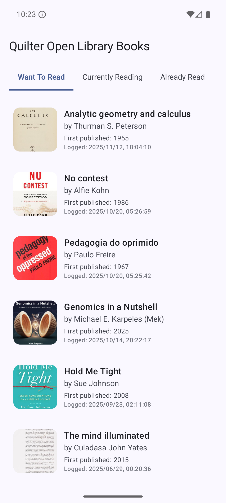
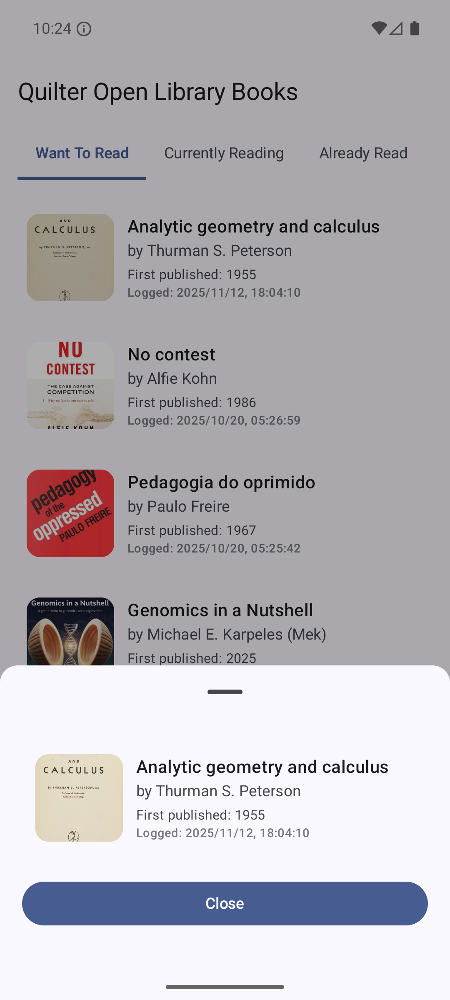

# Quilter – Book List App

A clean-architecture Android application built using **Jetpack Compose**, **MVVM + Clean Architecture**, **Hilt**, **Retrofit**, **OkHttp**, **Moshi**, and **RxJava**. This project fetches categorised reading data from the **OpenLibrary API** and displays it in a modern, reactive UI with a bottom-sheet detail view.

## API Used
https://openlibrary.org/people/mekBot/books/{category}.json

Categories:
- want-to-read
- currently-reading
- already-read

---

## Features

#### Categorised Book Lists
- Want to Read
- Currently Reading
- Already Read

#### Bottom Sheet Book Details
Shows:
- Book cover
- Title
- Author
- First published year
- Logged date

---

### Screenshots

  
  

## Tech Stack

- Kotlin
- Jetpack Compose
- Material 3
- MVVM + Clean Architecture
- Hilt
- Retrofit
- Moshi
- RxJava

---

### Author

**Subin Babu**  
Senior Android Developer  
Cambridge, UK
